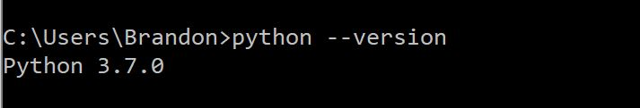

# CS3311
Data dump repository project

This project's client is the Center for Disease Control - National Center for Environmental Health. The purpose of this project is to store and parse internal documents to enable CDC employees to easily search for information about them.

The project was made for Georgia Tech's junior design program, and its members are as follow: Brandon Wei, Justin Liang, Stephen Farmer, James Ramos, Arvin Goyal.


# Install instructions

## MySQL Database Installation & MySQL workbench
A MySQL database is used to store document data and process queries from the webpage. A detailed installation guide for MySQL can be found here: https://dev.mysql.com/doc/mysql-installation-excerpt/5.7/en/. It is also important to install MySQL workbench as it makes interacting with the database much easier. 


## Installing Python
Python is the primary programming language used in this project. Pip is a package install manager for python that will be used to install the required frameworks and dependencies of the project. You can install Python on your machine using the installer provided here: https://www.python.org/downloads/
We recommend installing Python 3.7. To check that Python is successfully installed, open a command prompt and type the following command:
``` bash
python --version
```
You should then see the python version printed on the command prompt.


## Installing Pip
Pip is a package install manager for python used to pull the necessary dependencies of the project.
To install run the following command from the command prompt:
``` bash
python get-pip.py
```

To verify installation, run ```pip -V```

You should then see the python version printed on the command prompt.


## Downloading the Project Files
The project files can be obtained using ```git``` or downloaded from Github. Download the Zip file from Github and extract into the desired directory or using git in your desired directory run:
```https://github.com/stephenfarmer33/CS3311```


## Creating Database Tables
Using MySQL workbench, open the file ``` CS3311.sql``` Execute the file by clicking on the yellow lighting bolt. This will create the database tables used to store key information from the documents. 


## Downloading Dependencies 
Navigate to the root directory of the project and open the command prompt. Run the following command in the command prompt.

```pip install -r requirements.txt```

This will install all the required dependencies to run the project.

## Running the Project
Use the following command to run the project:

``` python App.py```

A link to a webpage should be generated. Open the link in your favorite browser to interact with the project. 


# Interacting with the Webpage UI

## Webpage Login

## Uploading Documents

### Uploading using Tinker UI

### Uploading using Webpage (Preferred)


## Query Documents

## Deletion 


TBD: Details of how to add, delete, and query documents


