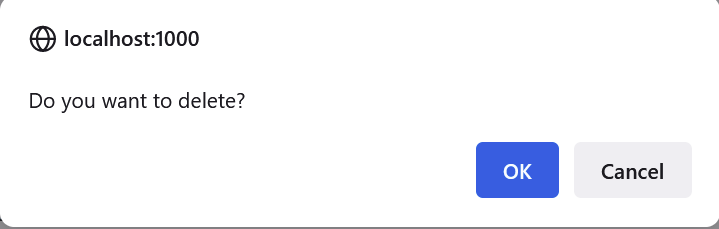

# CS3311
Data dump repository project

This project's client is the Center for Disease Control - National Center for Environmental Health. The purpose of this project is to store and parse internal documents to enable CDC employees to easily search for information about them.

The project was made for Georgia Tech's junior design program, and its members are as follow: Brandon Wei, Justin Liang, Stephen Farmer, James Ramos, Arvin Goyal.


# Install instructions

## MySQL Database Installation & MySQL workbench
A MySQL database is used to store document data and process queries from the webpage. A detailed installation guide for MySQL can be found here: https://dev.mysql.com/doc/mysql-installation-excerpt/5.7/en/. It is also important to install MySQL workbench as it makes interacting with the database much easier. 


## Installing Python
Python is the primary programming language used in this project. Pip is a package install manager for python that will be used to install the required frameworks and dependencies of the project. You can install Python on your machine using the installer provided here: https://www.python.org/downloads/
We recommend installing Python 3.7. To check that Python is successfully installed, open a command prompt and type the following command:
``` bash
python --version
```
You should then see the python version printed on the command prompt.


## Installing Pip
Pip is a package install manager for python used to pull the necessary dependencies of the project.
To install run the following command from the command prompt:
``` bash
python get-pip.py
```

To verify installation, run ```pip -V```

You should then see the python version printed on the command prompt.


## Downloading the Project Files
The project files can be obtained using ```git``` or downloaded from Github. Download the Zip file from Github and extract into the desired directory or using git in your desired directory run:
```https://github.com/stephenfarmer33/CS3311```


## Creating Database Tables
Using MySQL workbench, open the file ``` CS3311.sql``` Execute the file by clicking on the yellow lighting bolt. This will create the database tables used to store key information from the documents. 


## Downloading Dependencies 
Navigate to the root directory of the project and open the command prompt. Run the following command in the command prompt.

```pip install -r requirements.txt```

This will install all the required dependencies to run the project.

## Running the Project
Use the following command to run the project:

``` python App.py```

A link to a webpage should be generated. Open the link in your favorite browser to interact with the project. 

# Interacting with the Webpage UI

## Webpage Login

## Uploading Documents
To upload documents to the website to be parsed and subsequently inserted into the database, click the “Upload” button at the top right of the website.


The user will land on the page above. 


Upon clicking the “Browse…” button, users will have the
option to browse through their files on their home computer and select the Excel file(s) they want to be parsed. Clicking “Open” will upload the files to the website. Then, clicking the “Submit” button will parse the documents and insert the data into the database. 


Users will get a confirmation banner to indicate the files were successfully uploaded.

## Query Documents
The website has two tabs corresponding to the tables in the database. The “Activity” table, which can be reached from clicking the button on the top right called “Activity”, and the “Project” table, which can be reached from clicking the button in the middle called “Project”. Both the “Activity” page and “Project” hold the same functionality. Anything described as a function of the “Activity” page will as such work the same on the “Project” page.

Upon landing on the Activity page, the table might look like the below image.


Here we can see many important functions. At the top left, the user can choose to show between 10 entries and 100 entries per page. The bottom left will inform the user how many entries there are total within the “Activities” table in the database. The bottom right numbers allows the user to switch between the several pages to search through the “Activities” table. 

At the top right, below the “Add New Activities” button is the “Search” bar. This search bar is incredibly powerful and allows the user to query for any information they desire within the database. For example, if the user wants to find entries with information relating to “Grantee will complete the load”, if they search that exact phrase in the search bar, entries corresponding to that search phrase will be dynamically pulled up in the database.  


We can see from the image above that upon searching for the phrase, there is only one entry in the table that corresponds to it and the table dynamically shows those entries and filters out the other entries.

## Add Entries

The user may also manually add new entries to the “Activity” table if they desire. If the user clicks on the “Add New Activities” button on the top right, a window will pop-up allowing the user to fill in the information and “Submit” it to the table.


See the above image for what this pop-up looks like. Upon filling out the information and clicking “Add Activity”, the entry will be added to the database.

## Delete And/Or Edit Entries


In the last column of the table, there are two actions the user can enact. “Edit”, to edit the information in the given table entry, and “Delete”, to delete the data entirely. Clicking on “Edit” will bring up a pop-up where the user can “Update” the information in the given entry. 

The image to the bottom shows what this pop-up looks like. Upon changing some of the information in the pop-up and clicking “Update”, the changed information will be updated accordingly.


Upon clicking the “Delete” button, the user will be shown a pop-up asking the user to confirm the deletion. 



See the image above for how this will look like. Upon confirming, the given entry will be removed from the database entirely. 
